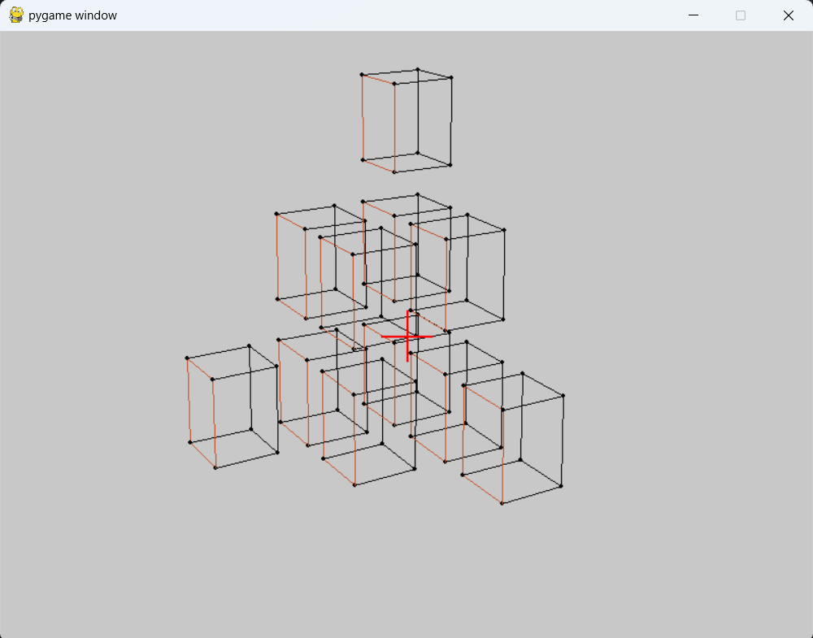

# Virtual-Camera

## Overview
The Virtual-Camera project simulates the functionality of a standard camera. It is designed to help users understand the basic operations of camera movement and rotation through a graphical user interface.

## Technology
The project is implemented in Python, utilizing the `pygame` and `numpy` libraries to manage graphics rendering and mathematical operations respectively.

## Installation
To run the Virtual-Camera, you need to have Python installed along with the following packages:
- pygame
- numpy

You can install these packages using pip:
```bash
pip install pygame numpy
```

## Usage
To start the project, open your terminal and run the following command:
```bash
python main.py [file_names.txt containing shapes to load]
```
For example run the folowing commend in Virtal-camera folder:
```bash
python main.py .\fig1.txt .\fig2.txt .\fig3.txt .\fig4.txt .\fig5.txt .\fig6.txt .\fig7.txt .\fig8.txt .\fig9.txt .\fig10.txt .\fig11.txt
```

## Controls
The Virtual-Camera supports various keyboard inputs to control the camera:
- <kbd>W</kbd> / <kbd>S</kbd> : Move the camera up and down.
- <kbd>A</kbd> / <kbd>D</kbd> : Move the camera left and right.
- <kbd>Arrow Up</kbd> / <kbd>Arrow Down</kbd> : Move the camera forward and backward.
- <kbd>Q</kbd> / <kbd>E</kbd> : Rotate the camera around the Y-axis.
- <kbd>Z</kbd> / <kbd>C</kbd> : Rotate the camera around the X-axis.
- <kbd>Arrow Left</kbd> / <kbd>Arrow Right</kbd> : Rotate the camera around the Z-axis.
- <kbd>I</kbd> / <kbd>O</kbd> : Zoom in and out.

## Preview
Below is a preview of what the Virtual-Camera can simulate:



## Features
This project provides a simple yet effective way to interact with a virtual environment simulating camera operations. Users can load  cubes via text files and manipulate the camera to view these shapes from different angles and distances.

## Contributing
Contributions to the Virtual-Camera project are welcome. Please feel free to fork the repository, make changes, and submit a pull request.
